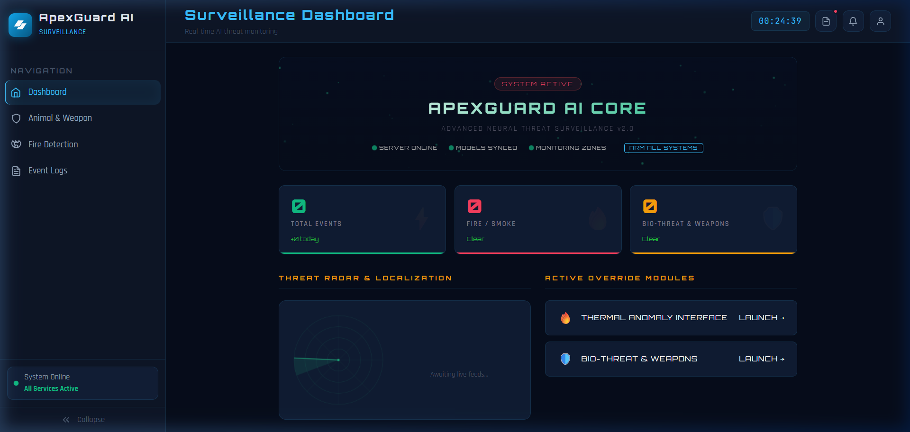
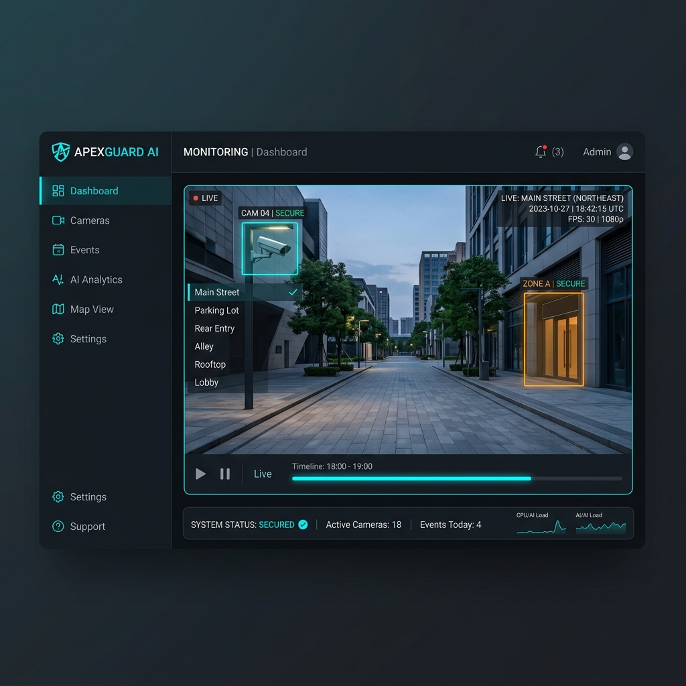
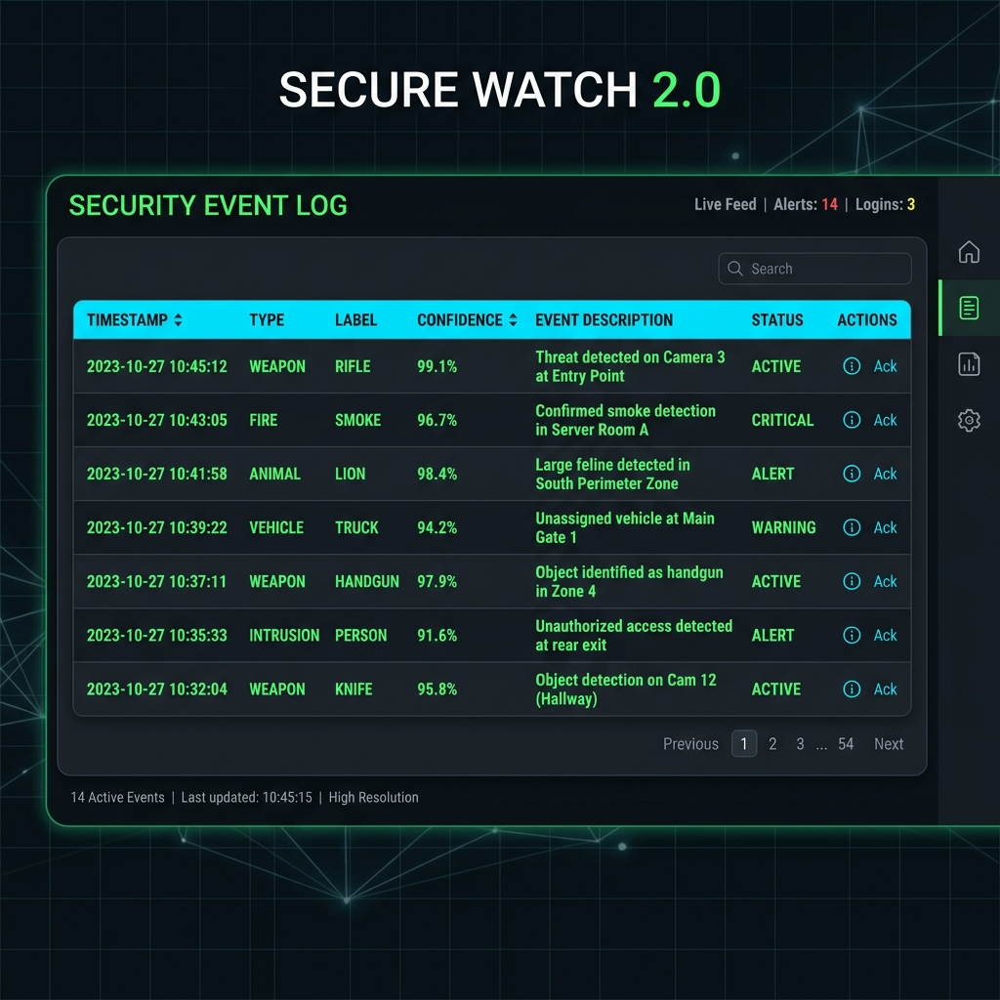
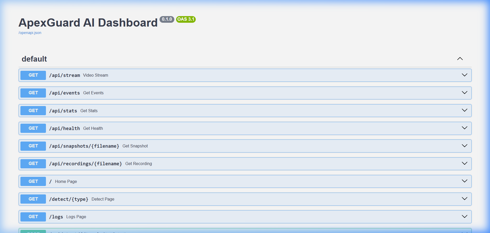
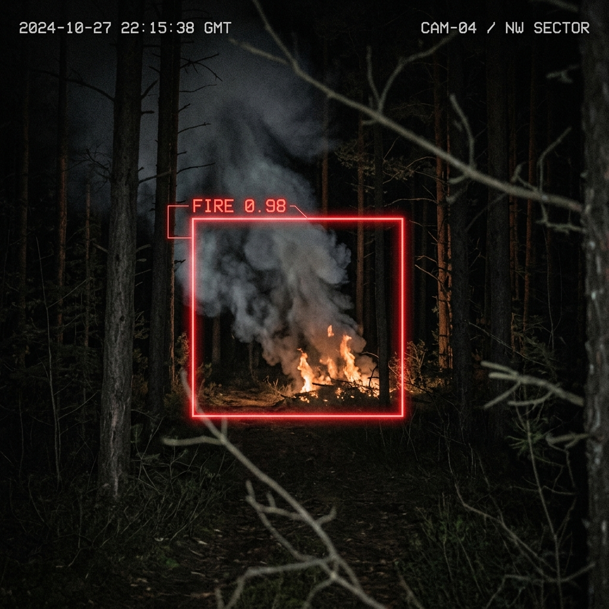
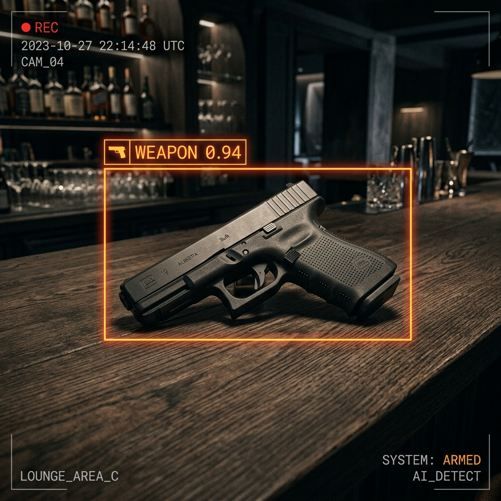
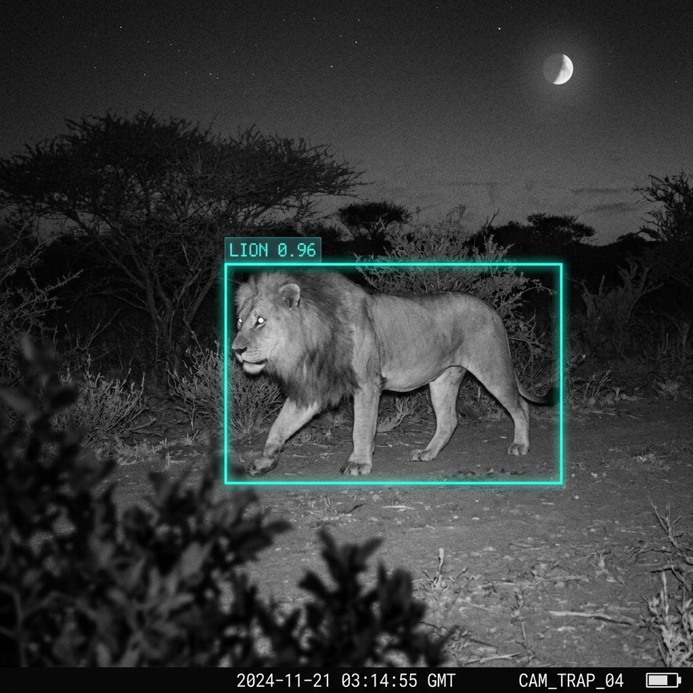

<div align="center">


# 🛡️ ApexGuard-AI

### Real-Time AI Surveillance · Threat Detection · Instant Alerts

[](https://python.org)
[](https://fastapi.tiangolo.com)
[](https://ultralytics.com)
[](https://opencv.org)
[](https://sqlite.org)
[](LICENSE)

**ApexGuard-AI** is a premium, production-grade real-time AI surveillance platform that concurrently detects **dangerous wildlife**, **fire & smoke outbreaks**, and **weapons** — all from a single camera feed. Built on a non-blocking FastAPI backend with YOLOv8/v9 inference, it delivers instant multi-channel alerts and a cinematic dark-themed dashboard.

</div>

---

## 📸 Screenshots

### 🏠 Main Dashboard


### 🎯 Live Detection View


### 📋 Event Logs


### 🔌 API Explorer (Swagger)


### 🐆 Detection Snapshots in Action

| 🔥 Fire Detection | 🔫 Weapon Detection | 🦁 Wildlife Detection |
|:-:|:-:|:-:|
|  |  |  |

---

## ⚡ Core Features

| Feature | Description |
|---|---|
| **🎯 Triple Threat Detection** | Concurrent real-time detection of Animals, Weapons, and Fire/Smoke from a single stream |
| **🐆 Dangerous Species Logic** | Tuned recognition for Tigers, Lions, Leopards, Bears, and Snakes |
| **🔥 Fire & Smoke Detection** | YOLOv9-based early-warning fire/smoke classifier for disaster prevention |
| **🔫 Weapon Identification** | Detects guns, rifles, pistols, knives, and other threats |
| **🚨 Multi-Channel Alerts** | Instant local siren (pygame) + desktop push notifications (plyer) |
| **💾 Auto Event Recording** | 8-second pre/post event video clips + HD snapshots saved automatically |
| **📊 Live Dashboard** | Dark-themed real-time MJPEG stream with annotated bounding boxes |
| **📋 Event Log Viewer** | Filterable, timestamped event history with snapshot previews |
| **🕸️ Versatile Camera Support** | USB Webcam, IP Camera (ONVIF/RTSP), and local video files |
| **⚡ Non-Blocking Architecture** | All AI inference runs in background threads; API stays responsive under load |
| **🔧 .env Configuration** | All sensitive settings isolated in `.env` — nothing hardcoded |

---

## 🏗️ Architecture & How It Works

```
┌──────────────────────────────────────────────────────────────────────┐
│                         ApexGuard-AI System                          │
│                                                                      │
│  ┌─────────────┐     ┌──────────────────────────────────────────┐    │
│  │   Camera    │────▶│            Detection Engine               │    │
│  │ (Webcam /   │     │   ┌────────────┐  ┌──────────────────┐   │    │
│  │  IP Cam)    │     │   │   Animal   │  │   Fire/Smoke     │   │    │
│  └─────────────┘     │   │  Detector  │  │    Detector      │   │    │
│                      │   │ (YOLOv8)   │  │   (YOLOv9-ft)    │   │    │
│  ┌─────────────┐     │   └────────────┘  └──────────────────┘   │    │
│  │  FastAPI    │     │   ┌──────────────────────────────────┐   │    │
│  │  Backend    │◀────│   │       Weapon Detector            │   │    │
│  │ (Uvicorn)   │     │   │       (YOLOv8n)                  │   │    │
│  └─────────────┘     │   └──────────────────────────────────┘   │    │
│        │             └──────────────────────────────────────────┘    │
│        │                             │                               │
│        ▼                             ▼                               │
│  ┌──────────┐               ┌─────────────────┐                      │
│  │  Web UI  │               │  Alert System   │                      │
│  │ (HTML/JS)│               │ Siren + Notif.  │                      │
│  └──────────┘               └─────────────────┘                      │
│                                      │                               │
│                              ┌───────────────┐                       │
│                              │  Event Logger │                       │
│                              │ SQLite + CSV  │                       │
│                              └───────────────┘                       │
└──────────────────────────────────────────────────────────────────────┘
```

### 🔄 Detection Pipeline

1. **Camera Frame Capture** — `core/video_capture.py` reads frames from webcam/IP camera using OpenCV at a configurable FPS
2. **Threat Engine Loop** — `core/engine.py` runs a background thread (non-blocking) that passes each frame to all active detectors simultaneously
3. **Model Inference** — Each detector runs YOLOv8/v9 inference and filters results against confidence thresholds and label allowlists
4. **Alert Trigger** — On first detection of a new threat, `core/alert_system.py` fires the siren + desktop notification with a cooldown to prevent spam
5. **Event Recording** — `core/event_recorder.py` writes a pre-buffered 8-second clip (`.mp4`) and a HD snapshot (`.jpg`) to disk
6. **Event Logging** — `core/event_logger.py` appends the detection event to both SQLite (`surveillance.db`) and a CSV audit log
7. **Live Stream** — `api/stream.py` encodes the annotated frame as MJPEG and streams it to the dashboard in real time
8. **Dashboard** — The Vanilla JS frontend polls the API for events and renders them; the MJPEG `` tag auto-updates at camera FPS

---

## 🤖 Models Used

| Model | File | Purpose | Architecture |
|---|---|---|---|
| **Animal Detector** | `models/animal_detect.pt` | Detects dangerous wildlife (lions, tigers, bears, leopards, snakes) | YOLOv8n — fine-tuned on wildlife dataset |
| **Fire/Smoke Detector** | `models/fire_detect.pt` | Early-warning fire & smoke classification | YOLOv9 — fine-tuned on fire dataset |
| **Weapon Detector** | `models/weapon_detect.pt` or `yolov8n.pt` | Detects guns, pistols, rifles, knives | YOLOv8n — COCO pre-trained with weapon classes |

> **Note:** Model weights (`.pt` files) are **not included in this repo** due to file size. Run `python download_models.py` after cloning.

### Confidence Thresholds (configurable via `.env`)

| Detector | Default Threshold | Reason |
|---|---|---|
| Animal | 0.50 | Balanced precision for wildlife |
| Fire/Smoke | 0.50 | Prevents false triggers on warm lighting |
| Weapon | 0.40 | Catches threats early even at lower confidence |

---

## 🛠️ Tech Stack

### Backend
| Technology | Version | Role |
|---|---|---|
| **Python** | 3.9 – 3.12 | Core language |
| **FastAPI** | 0.111 | Async REST API framework |
| **Uvicorn** | 0.29 | ASGI server (asyncio, h11) |
| **SQLAlchemy** | 2.0 | ORM for SQLite event database |
| **python-dotenv** | 1.0 | `.env` config loader |

### AI / Computer Vision
| Technology | Version | Role |
|---|---|---|
| **Ultralytics** | 8.2.18 | YOLOv8/v9 model runtime & inference |
| **OpenCV** | 4.9 | Camera capture, frame drawing, MJPEG encoding |
| **CUDA** *(optional)* | — | GPU acceleration for NVIDIA cards |

### Alerts & I/O
| Technology | Version | Role |
|---|---|---|
| **pygame** | 2.5.2 | Cross-platform siren audio playback |
| **plyer** | 2.1.0 | Native desktop push notifications |

### Frontend
| Technology | Role |
|---|---|
| **Vanilla HTML5 / CSS3** | Dashboard structure & dark theme |
| **Vanilla JavaScript** | Live MJPEG stream, API polling, event rendering |
| **CSS Custom Properties** | Design tokens for cyberpunk color system |

---

## 📁 Project Structure

```
ApexGuard-AI/
├── 📂 backend/                      # Python Server & Intelligence
│   ├── 📂 api/                      # FastAPI application layer
│   │   ├── main.py                  # App entry point
│   │   ├── stream.py                # MJPEG stream endpoint
│   │   ├── database.py              # DB init
│   │   └── routes/                  # API endpoints
│   ├── 📂 core/                     # Detection engine & logic
│   │   ├── engine.py                # Background threat loop
│   │   ├── alert_system.py          # Siren & notifications
│   │   └── detectors/               # AI inference modules
│   ├── 📂 docs/                     # Technical documentation & screenshots
│   ├── 📂 sounds/                   # Alert audio files
│   ├── config.py                    # Central configuration
│   ├── start_server.py              # Production launcher
│   └── requirements.txt             # Dependencies
│
├── 📂 frontend/                     # Dashboard User Interface
│   ├── index.html                   # Main dashboard
│   ├── style.css                    # Dark theme styles
│   └── app.js                       # Frontend logic
│
├── 📂 models/                       # AI weight files (.pt)
│
└── 📂 recordings_snapshots/         # Local media storage
    ├── 📂 recordings/               # Event video clips
    └── 📂 snapshots/                # HD detection images

```

---

## 🚀 Quick Start

### 1. Clone the Repository

```bash
git clone https://github.com/Ameyavasthi/ApexGuard-AI.git
cd ApexGuard-AI
```

### 2. Create Virtual Environment

```bash
python -m venv venv

# Windows
venv\Scripts\activate

# Linux / macOS
source venv/bin/activate
```

### 3. Install Dependencies

```bash
pip install --upgrade pip
pip install -r requirements.txt
```

### 4. Configure Environment

```bash
# Copy the template and fill in your values
cp .env.example .env
```

Edit `.env` with your camera source, thresholds, and port settings.

### 5. Download AI Models

```bash
python download_models.py
```

> [!IMPORTANT]
> The `models/` directory is **gitignored**. You must run `download_models.py` to fetch the weight files before starting the server.

### 6. Add Alarm Sound

Place your preferred alert audio file at:
```
sounds/siren.mp3
```

### 7. Launch the Server

```bash
python start_server.py
```

🔥 Open the dashboard at **[http://localhost:8005](http://localhost:8005)**

---

## ⚙️ Configuration Reference (`.env`)

| Variable | Default | Description |
|---|---|---|
| `HOST` | `0.0.0.0` | Server bind address |
| `PORT` | `8005` | Server port |
| `ACTIVE_CAMERA` | `webcam` | Camera mode: `webcam` or `ip_camera` |
| `WEBCAM_SOURCE` | `0` | Webcam device index |
| `IP_CAMERA_SOURCE` | — | IP camera URL (RTSP/HTTP) |
| `ANIMAL_CONFIDENCE_THRESHOLD` | `0.50` | Min confidence for animal alerts |
| `FIRE_CONFIDENCE_THRESHOLD` | `0.50` | Min confidence for fire/smoke alerts |
| `WEAPON_CONFIDENCE_THRESHOLD` | `0.40` | Min confidence for weapon alerts |
| `ALERT_COOLDOWN_SECONDS` | `30` | Seconds between repeated alerts |
| `CLIP_DURATION_SECONDS` | `8` | Length of recorded event clips |
| `CAMERA_FPS` | `20` | Camera capture framerate |
| `PRE_EVENT_BUFFER_FRAMES` | `40` | Frames buffered before event trigger |

---

## 📡 API Reference

| Method | Endpoint | Description |
|---|---|---|
| `GET` | `/` | Main dashboard page |
| `GET` | `/detect/{type}` | Live detection page (`animal`/`fire`/`weapon`) |
| `GET` | `/logs` | Event log viewer |
| `GET` | `/stream` | Live annotated MJPEG video feed |
| `GET` | `/api/events` | JSON — all detection events |
| `GET` | `/api/logs/data` | CSV event log as JSON |
| `GET` | `/api/snapshots` | List of saved snapshot files |
| `GET` | `/api/recordings` | List of saved video clips |
| `POST` | `/api/start/{module}` | Enable detection module (`animal`/`fire`/`weapon`) |
| `POST` | `/api/stop/{module}` | Disable detection module |
| `GET` | `/docs` | Interactive Swagger API documentation |

---

## 🖥️ System Requirements

| Component | Minimum | Recommended |
|---|---|---|
| **CPU** | Dual-core Intel i5 / Ryzen 5 | Quad-core i7 / Ryzen 7 |
| **RAM** | 8 GB | 16 GB+ |
| **GPU** | Integrated Graphics (CPU mode) | NVIDIA GTX 1650+ (4 GB VRAM) |
| **Storage** | 2 GB free SSD | 10 GB+ high-speed SSD |
| **Camera** | USB 720p Webcam | 1080p IP Camera (RTSP) |
| **OS** | Windows 10 / Ubuntu 20.04 / macOS | Windows 11 / Ubuntu 22.04 |
| **Python** | 3.9 | 3.10 – 3.12 |

---

## 🔐 Security & Privacy

- All configurable settings (camera URLs, ports, thresholds) live in `.env` — **never committed to Git**
- The `.env.example` template is safe to commit; it contains no real credentials
- Model weights are excluded from the repository (large binary files)
- Recorded clips and snapshots are gitignored by default
- The SQLite database is local-only and gitignored

---

## ⚖️ License

Distributed under the **MIT License**. See [`LICENSE`](LICENSE) for details.

---

<div align="center">

**Built with ❤️ for Wildlife Safety & Public Security**

*ApexGuard-AI — Watching over what matters most.*

</div>
